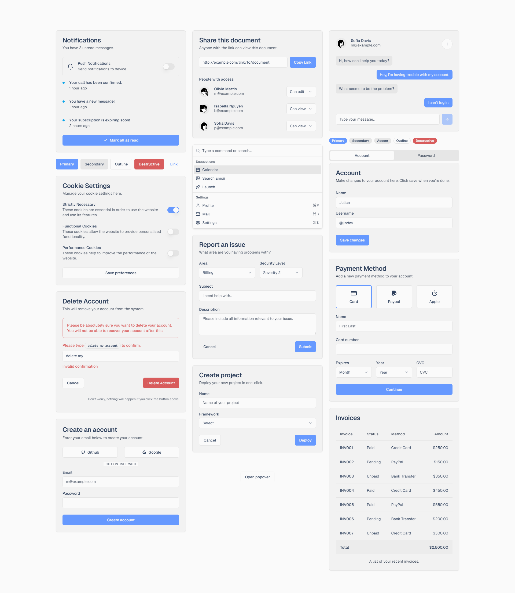

# Kōyō Color Scheme

Kōyō is an aesthetic color scheme inspired by Japanese culture. It showcases various shades of blue that evoke a sense of calmness and serenity, similar to the natural colors found in nature. The name "Kōyō" reflects the vibrant hues of autumn leaves in Japanese, but in this context, it represents the tranquil and soothing blues featured in the palette.

Experience live previews of Kōyō Color Scheme themes for [shadcn/ui](https://ui.jln.dev/).

## Colors

The Kōyō color palette features a carefully selected range of blue hues that evoke a sense of tranquility and natural beauty. These colors are:

accent

<table align="center">
<tr>
<th>Preview</th>
<th>Variable</th>
<th>Hex</th>
<th>RGB</th>
<th>HSL</th>
</tr>
<tr>
<td></td>
<td><code>base</code></td>
<td><code>#6699ff</code></td>
<td><code>102,153,255</code></td>
<td><code>220,100,70</code></td>
</tr>
<tr>
<td></td>
<td><code>destructive</code></td>
<td><code>#d85c5c</code></td>
<td><code>216,92,92</code></td>
<td><code>0,61,60</code></td>
</tr>
</table>

text

<table align="center">
<tr>
<th>Preview</th>
<th>Variable</th>
<th>Hex</th>
<th>RGB</th>
<th>HSL</th>
</tr>
<tr>
<td></td>
<td><code>base</code></td>
<td><code>#2e405c</code></td>
<td><code>46,64,92</code></td>
<td><code>217,33,27</code></td>
</tr>
<tr>
<td></td>
<td><code>muted</code></td>
<td><code>#444f60</code></td>
<td><code>68,79,96</code></td>
<td><code>216,17,32</code></td>
</tr>
</table>

background

<table align="center">
<tr>
<th>Preview</th>
<th>Variable</th>
<th>Hex</th>
<th>RGB</th>
<th>HSL</th>
</tr>
<tr>
<td></td>
<td><code>base</code></td>
<td><code>#FAFAFA</code></td>
<td><code>250,250,250</code></td>
<td><code>0,0,98</code></td>
</tr>
<tr>
<td></td>
<td><code>mantle</code></td>
<td><code>#F2F2F2</code></td>
<td><code>242,242,242</code></td>
<td><code>0,0,95</code></td>
</tr>
<tr>
<td></td>
<td><code>crust</code></td>
<td><code>#E4E4E4</code></td>
<td><code>228,228,228</code></td>
<td><code>0,0,89</code></td>
</tr>
</table>

 Each color has been meticulously selected to harmonize with the others in the palette, providing a versatile range that can be utilized in various design and development projects.

## Credits

This color scheme draws inspiration from the serene beauty of Japanese autumn leaves. We hope it proves beneficial for your projects!

## License

This color scheme is licensed under the [MIT License](LICENSE).

---

Feel free to contribute to the Kōyō color scheme by suggesting improvements or additional colors. We welcome your feedback and contributions!

Happy coding! 🍂
